# miniRT

*This project has been created as part of the 42 curriculum by pchalmin and tle-floc.*

## Contents

* [Description](#description)
	* [Features](#features)
	* [Bonus features](#bonus-features)
	* [Images](#images)
	* [Technical constraints](#technical-constraints)
	* [Allowed external functions](#allowed-external-functions)
* [Tools](#tools)
* [Project architecture](#project-architecture)
* [Instructions](#instructions)
	* [Makefile](#makefile)
	* [Run program](#run-program)
* [Input](#input)
	* [Camera](#camera)
	* [Menu management](#menu-management)
	* [Other](#other)
* [Understanding the scene file](#understanding-the-scene-file)
	* [General rules](#general-rules)
	* [Element reference](#element-reference)
	* [Ambient lighting](#ambient-lighting)
	* [Camera](#camera-1)
	* [Light](#light)
	* [Sphere](#sphere)
	* [Plane](#plane)
	* [Cylinder](#cylinder)
	* [Bonus](#bonus)
		* [Checkerboard / Bump Map / Texture](#checkerboard--bump-map--texture)
		* [Cone](#cone)
	* [Simple example scene](#simple-example-scene)
	* [Common errors detected by the parser](#common-errors-detected-by-the-parser)
* [Resources](#resources)

## Description

miniRT is a minimalist ray tracer written in C. It renders 3D scenes described in a simple text file (with the `.rt` extension) and displays the resulting image in a window, using the ray tracing technique : for each pixel, a ray is cast from the camera into the scene and the program computes the closest intersection with the objects to determine the pixel's color.

### Features

#### Geometric objects
- Three basic primitives : plane, sphere and cylinder.
- Correct handling of all possible ray intersections, including the inside of objects.
- Resizable properties : the diameter of all objects (and the height, if applicable).

#### Transformations
- Translation and rotation of objects, lights and cameras.
- Exceptions : spheres and point lights cannot be rotated (rotation has no visible effect on them).

#### Lighting
- Ambient lighting, so that objects are never completely in the dark.
- Diffuse lighting.
- Adjustable spot light brightness.
- Hard shadows.

#### Window management
- Smooth window handling: switching to another window, minimizing, etc.
- Pressing `ESC` closes the window and quits the program cleanly.
- Clicking the red cross on the window frame closes the window and quits the program cleanly.

#### Scene parsing
- The program takes a `.rt` scene description file as its first argument.
- Any misconfiguration in the file makes the program exit properly, printing `Error\n` followed by an explicit error message.

### Bonus features

- Specular reflection, for a full Phong reflection model.
- Color disruption: checkerboard pattern (the second color is the opposite color of the object).
- Colored and multi-spot lights.
- An additional second-degree object: cone.
- Bump map textures.
- Object textures.

### Images

Simple scene :
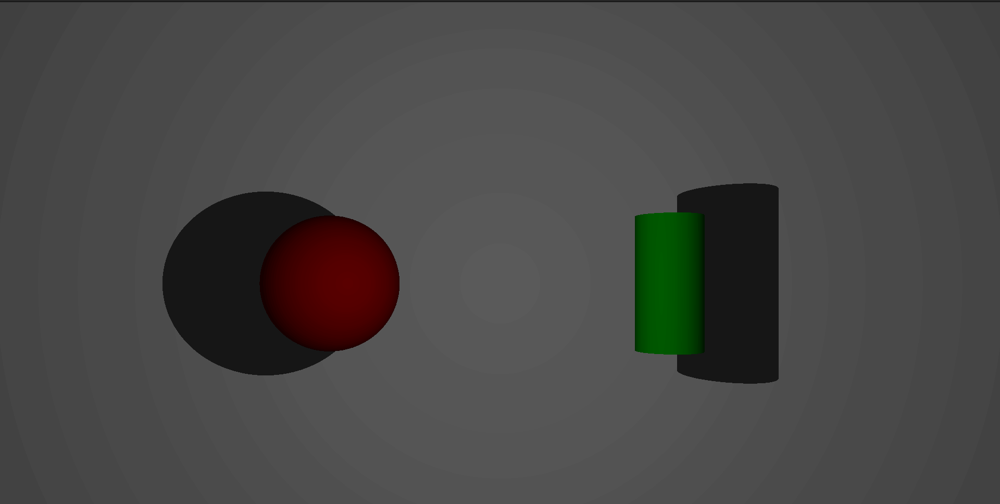

Simple scene bonus (with cone and specular reflection) :
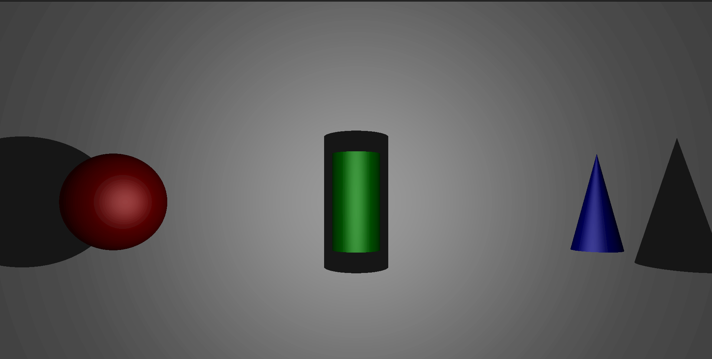

Move (with resolution changed) :


Camera rotation (first with the keyboard, then with the mouse) :

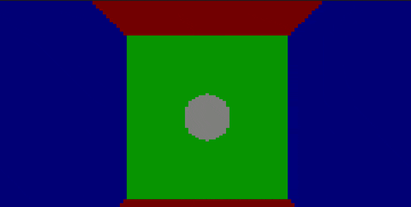

Additive color mixing (3 colored lights R, G and B) :
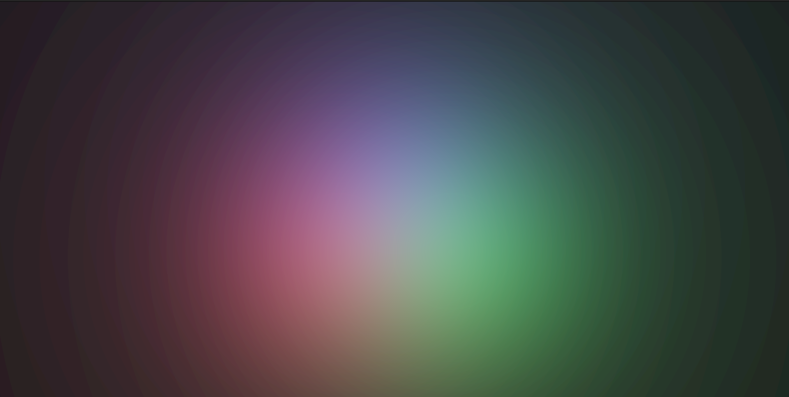

Substractive color mixing (3 colored lights R, G and B and a sphere behind the camera) :
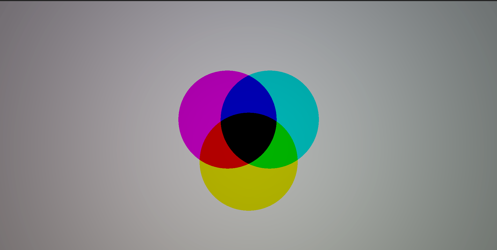

Checkerboard pattern (the 6 available patterns in different colors) :
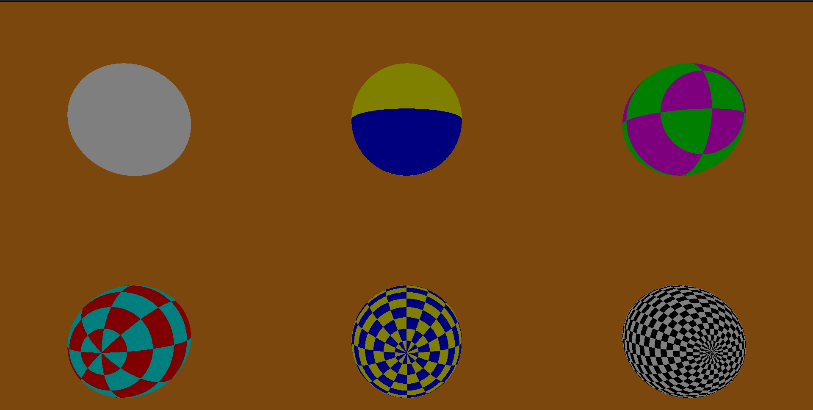

Menu use to translate and rotate the cylinder/plane and translate the light :

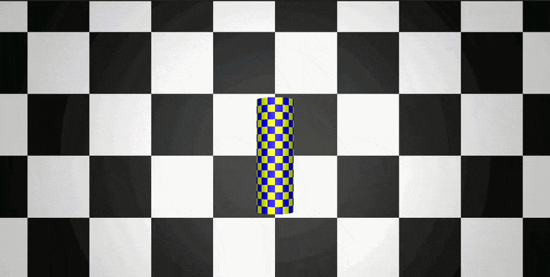

Bump map textures (it's not a texture, but a modification of how light reflects off the object to create the impression of depth) :
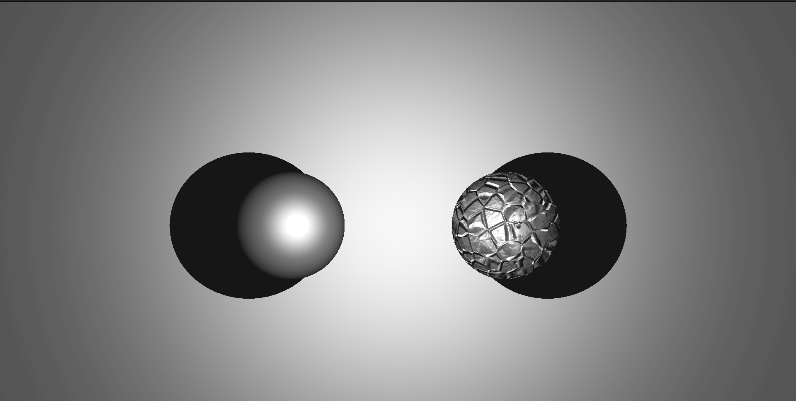

Textures :
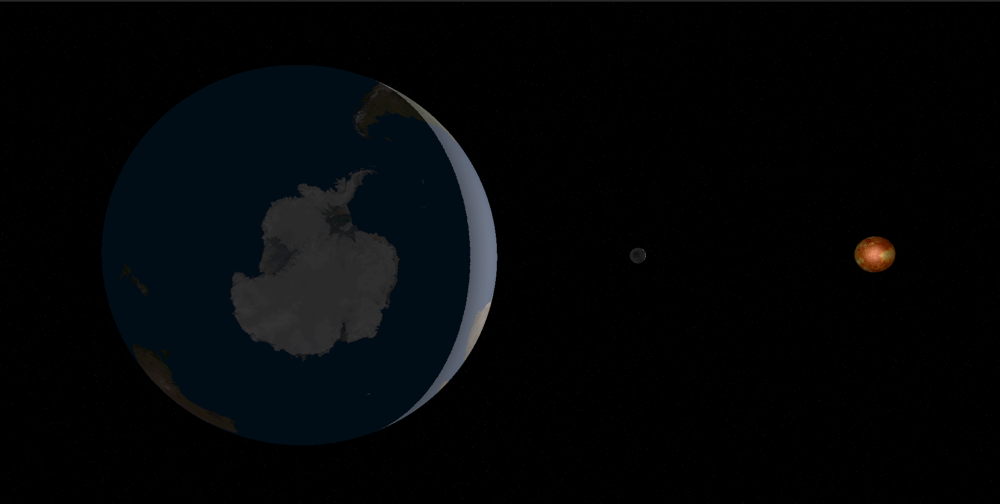
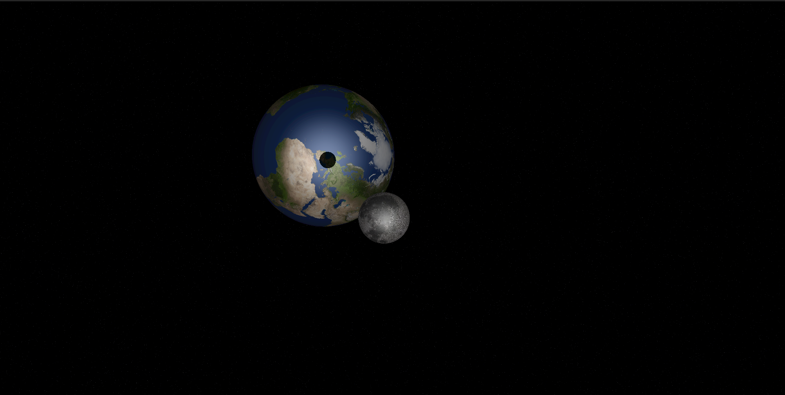

Many features :
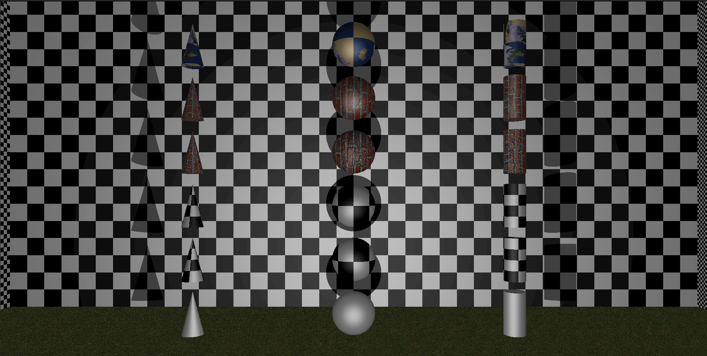

### Technical constraints
- Global variables are not allowed.
- No memory leaks are tolerated in the project's own code (leaks originating from [external functions](#allowed-external-functions) itself are not considered).
- This project must be written in accordance with the [42 Norm](https://github.com/42School/norminette).

### Allowed external functions
- `open`, `close`, `read`, `write`, `printf`, `malloc`, `free`, `perror`, `strerror`, `exit`, `gettimeofday`.
- All functions of the math library.
- All functions of the MacroLibX library.

The [MacroLibX](https://github.com/seekrs/MacroLibX) is rewritten version of the minilibx graphics API used at 42school, using SDL2 & Vulkan.

## Tools

| Tool | Version |
|------|---------|
| clang | 12 |
| Make | any |
| MacroLibX | 2.1.0 |

## Project architecture
At the root of the project repository are :
- The `miniRT` folder : the project’s deliverables folder.
- `file_test_supp.rt` : test files for parsing and basic scenes.
- `en.subject.pdf` : the project brief.
- `miniRt.excalidraw` : an Excalidraw file containing explanatory diagrams and the mathematical calculations performed.

## Instructions

All commands are executed in the miniRT directory.

### Makefile

Use the provided `Makefile` to compile the project and manage it:

| Command | Description |
|--------|-------------|
| `make` | Compile the project |
| `make bonus` | Compile the project with the bonus part |
| `make clean` | Remove object files |
| `make fclean` | Remove object files and executables |
| `make re` | Clean and recompile the project |

### Run program

To launch the program :
```bash
./miniRT [scene].rt
```

For the bonus :
```bash
./miniRT_bonus [scene].rt
```

Example :
```bash
./miniRT scene/map/manda/one_obj/sphere.rt
```

> [!WARNING]
> The parsing for the bonus section is different from that for the mandatory section. A scene that works for the mandatory section will not work for the bonus section, and vice versa.

> [!NOTE]
> Preconfigured scenes are available in the `scene/map/` folder.

## Input
### Camera
- `W` / `S` : Forward / Backward.
- `A` / `D` : Left / Right.
- `Space` / `F` : Up / Down.
- `Q` / `W` : Rotation on the forward axis.

### Menu management
- `M` : open the menu selection.
- `O` : open the obj menu.
- `L` : open the light menu.
- `N` : switch to the next element.
- `↑` or `↓` : select the data you will modify.
- `←` or `→` : decrement or increment the data was selected.

### Other
- `Escape` : Quit the program.
- `F9` : Use the mouse to rotate the camera.
- `F10` : Change resolution (useful for keeping the scene flowing and moving around).
- `F11` : Full screen.

## Understanding the scene file

A `.rt` file (scene file) is a plain-text description of a 3D scene. Each line describes one element (light, camera, object...) and starts with a "type identifier", followed by the element's properties in a strict order.

### General rules

- Elements can be separated by one or more line breaks.
- Pieces of information within an element can be separated by one or more spaces.
- Elements can be declared in any order in the file.
- Elements identified by a capital letter (`A`, `C`, `L`) can be declared only once per scene (except `L` for bonus section).
- Vectors and colors are written as comma-separated values with no spaces (e.g. `0.0,1.0,0.0`).
- Any invalid or missing information causes the program to exit with `Error\n` and an explicit message.

### Element reference

| Identifier | Element | Unique |
|:---:|---|:---:|
| `A` | Ambient lighting | ✔ |
| `C` | Camera | ✔ |
| `L` | Light | mandatory ✔ / bonus ✘ |
| `sp` | Sphere | ✘ |
| `pl` | Plane | ✘ |
| `cy` | Cylinder | ✘ |
| `co` | Cone (bonus) | ✘ |

### Ambient lighting

Example :
```
A 0.2 255,255,255
```

| Field | Description | Range |
|---|---|---|
| `A` | Identifier | n/a |
| `0.2` | Ambient lighting ratio | `[0.0, 1.0]` |
| `255,255,255` | R, G, B color | `[0, 255]` each |

### Camera

Example :
```
C -50.0,0,20 0,0,1 70
```

| Field | Description | Range |
|---|---|---|
| `C` | Identifier | n/a |
| `-50.0,0,20` | x, y, z coordinates of the viewpoint | any float |
| `0,0,1` | 3D normalized orientation vector | `[-1, 1]` for each axis |
| `70` | Horizontal field of view (FOV), in degrees | `[0, 180]` |

### Light

Example :
```
L -40.0,50.0,0.0 0.6 10,0,255
```

| Field | Description | Range |
|---|---|---|
| `L` | Identifier | n/a |
| `-40.0,50.0,0.0` | x, y, z coordinates of the light point | any float |
| `0.6` | Light brightness ratio | `[0.0, 1.0]` |
| `10,0,255` | R, G, B color *(defined but unused in the mandatory part)* | `[0, 255]` each |

### Sphere

Example :
```
sp 0.0,0.0,20.6 12.6 10,0,255
```

| Field | Description | Range |
|---|---|---|
| `sp` | Identifier | n/a |
| `0.0,0.0,20.6` | x, y, z coordinates of the center | any float |
| `12.6` | Diameter | positive float |
| `10,0,255` | R, G, B color | `[0, 255]` each |

### Plane

Example :
```
pl 0.0,0.0,-10.0 0.0,1.0,0.0 0,0,225
```

| Field | Description | Range |
|---|---|---|
| `pl` | Identifier | n/a |
| `0.0,0.0,-10.0` | x, y, z coordinates of a point on the plane | any float |
| `0.0,1.0,0.0` | 3D normalized normal vector | `[-1, 1]` for each axis |
| `0,0,225` | R, G, B color | `[0, 255]` each |

### Cylinder

Example :
```
cy 50.0,0.0,20.6 0.0,0.0,1.0 14.2 21.42 10,0,255
```

| Field | Description | Range |
|---|---|---|
| `cy` | Identifier | n/a |
| `50.0,0.0,20.6` | x, y, z coordinates of the cylinder's center | any float |
| `0.0,0.0,1.0` | 3D normalized axis vector | `[-1, 1]` for each axis |
| `14.2` | Diameter | positive float |
| `21.42` | Height | positive float |
| `10,0,255` | R, G, B color | `[0, 255]` each |

### Bonus

#### Checkerboard / Bump Map / Texture

Each object must define these fields in the bonus section.

Example :
```
sp 0.0,0.0,20.6 12.6 10,0,255 3 brick_texture.png brick_bump.png
```

| Field | Description | Value to disable |
|---|---|---|
| `3` | The partition of the checkerboard (2^value) defined by an integer on [0, 5] | 0 |
| `brick_texture.png` | Path of the texture image | NULL |
| `brick_bump.png` | Path of the bump map image | NULL |

#### Cone

Same as the cylinder.

Example :
```
co 50.0,0.0,20.6 0.0,0.0,1.0 14.2 21.42 10,0,255 0 NULL NULL
```

### Simple example scene
Mandatory section :
```
A 0.2 255,255,255

C -50,0,20 0,0,1 70

L -40,0,30 0.7 255,255,255

pl 0,0,0 0,1.0,0 255,0,225
sp 0,0,20 20 255,0,0
cy 50.0,0.0,20.6 0,0,1.0 14.2 21.42 10,0,255
```

Bonus section :
```
A 0.2 255,255,255

C -50,0,20 0,0,1 70

L -40,0,30 0.7 200,200,200

pl 0,0,0 0,1.0,0 255,0,225 0 NULL NULL
sp 0,0,20 20 255,0,0 0 NULL NULL
cy 50.0,0.0,20.6 0,0,1.0 14.2 21.42 10,0,255 0 NULL NULL
co 0.0,70.0,0.0 0,1.0,0 7.6 10.23 0,255,255 0 NULL NULL
```

### Common errors detected by the parser

- Unknown identifier.
- Duplicate declaration of `A`, `C` or `L` (except `L` for the bonus section).
- Missing or extra fields for an element.
- Values out of range (colors, ratios, FOV).
- Malformed numbers or vectors (e.g. missing commas).
- Invalid file extension (must be `.rt`) or unreadable file.

## Resources
### Raytracing
[Basic Raytracing](https://www.gabrielgambetta.com/computer-graphics-from-scratch/02-basic-raytracing.html)

[Ray Tracing in One Weekend](https://raytracing.github.io/books/RayTracingInOneWeekend.html)

[Ray Tracer in Computer Graphics](https://physique.cmaisonneuve.qc.ca/svezina/nyc/note_nyc/NYC_CHAP_6_IMPRIMABLE_4.pdf)

[Realistic Surface Rendering](https://www.research.autodesk.com/app/uploads/2023/03/rendu-realiste-de-surfaces.pdf_reckRMcEDKfhimCkK.pdf)

[Compute Graphics Notes](https://anirudh-s-kumar.github.io/CG-Notes/#my-personal-review-of-the-course)


### Quaternions
[Quaternion - Wikipedia](https://en.wikipedia.org/wiki/Quaternion)

[Quaternion - Wikipedia fr](https://fr.wikipedia.org/wiki/Quaternion)

[Quaternions and spatial rotation - Wikipedia](https://en.wikipedia.org/wiki/Quaternions_and_spatial_rotation)

[Quaternions and spatial rotation - Wikipedia fr](https://fr.wikipedia.org/wiki/Quaternions_et_rotation_dans_l%27espace)

[Implementing Quaternions in C++](https://www.haroldserrano.com/blog/developing-a-math-engine-in-c-implementing-quaternions)

[Rotations, Orientation and Quaternions](https://ch.mathworks.com/help/fusion/ug/rotations-orientation-and-quaternions.html)


### Math
[Cylinder Formula - Stack Overflow](https://stackoverflow.com/questions/73866852/ray-cylinder-intersection-formula)

[Object Formula](https://hugi.scene.org/online/hugi24/coding%20graphics%20chris%20dragan%20raytracing%20shapes.htm)

[Change of basis - Wikipedia](https://en.wikipedia.org/wiki/Change_of_basis)

[Change of basis - Wikipedia fr](https://fr.wikipedia.org/wiki/Changement_de_base_(alg%C3%A8bre_lin%C3%A9aire))

[Atan2 - Wikipedia](https://en.wikipedia.org/wiki/Atan2)

[Sphere - Wikipedia](https://en.wikipedia.org/wiki/Sphere)


### Camera
[Orientation - Stack Exchange](https://gamedev.stackexchange.com/questions/121654/getting-the-right-vector-from-the-forward-vector)

[3D Camera Rotation (Unwanted Roll) - Space/Flight Cam - Stack Exchange](https://gamedev.stackexchange.com/questions/183748/3d-camera-rotation-unwanted-roll-space-flight-cam)

[Why rotate an object on two axes, twist around the third? - Stack Exchange](https://gamedev.stackexchange.com/questions/136174/im-rotating-an-object-on-two-axes-so-why-does-it-keep-twisting-around-the-thir)


### GeoGebra
[GeoGebra 3D](https://www.geogebra.org/3d)

[Dot Product](https://www.geogebra.org/m/Yu6869By)

[Cross Product](https://www.geogebra.org/m/psMTGDgc)


### UV
[UV Coordinates Mapped (with animation) - Stack Overflow](https://gamedev.stackexchange.com/questions/197931/how-can-i-correctly-map-a-texture-onto-a-sphere)

[Spherical coordinate system - Wikipedia](https://en.wikipedia.org/wiki/Spherical_coordinate_system)

[Cylindrical coordinate system - Wikipedia](https://en.wikipedia.org/wiki/Cylindrical_coordinate_system)


### Normal mapping
[Advanced Ray Tracer - Medium](https://medium.com/@Ksatese/advanced-ray-tracer-part-4-87d1c98eecff)

[Compute sphere tangent for normal mapping - Stack Exchange](https://computergraphics.stackexchange.com/questions/5498/compute-sphere-tangent-for-normal-mapping)

[Normal Mapping - Learn OpenGL](https://learnopengl.com/Advanced-Lighting/Normal-Mapping)

[Normal Mapping - Wikipedia](https://en.wikipedia.org/wiki/Normal_mapping)
